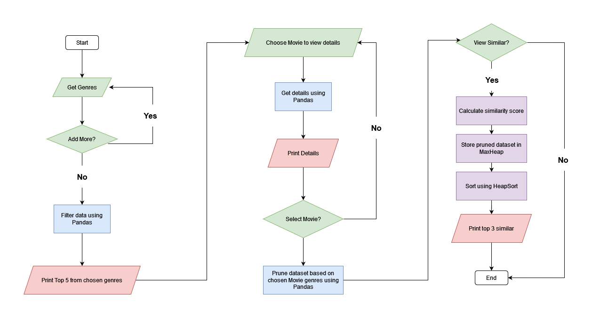

# Codecademy_Recommendation-Software

Dataset: [IMDb Movies (231129 - 231201) by popularity](https://www.kaggle.com/datasets/elvinrustam/imdb-movies-dataset/)

## General Plan
We will use Pandas to narrow down the dataset that we will work with. Then using the recommender, suggest 3 other movies based on a similarity score calculated naively from 'Motion Picture Rating', 'Runtime' and 'Rating'.

## User Flow

## Recommender Plan
1. Prune data based on chosen movie 'Main Genres'
2. Calculate naive similarity score based on based on 'Motion Picture Rating', 'Runtime' and 'Rating'.
2. Put data into **MaxHeap** data structure.
3. Use **HeapSort** to sort by similarity score 

## To-do:
- General refactor
